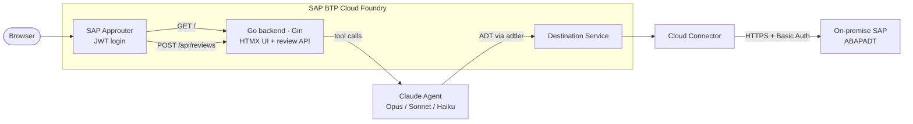

# AI ABAP Code Review Service

**AI-powered ABAP code review on SAP BTP — fork it, deploy it in an afternoon.**

This service connects Claude (Anthropic's AI) to your SAP system's ADT API and reviews transport requests automatically: ATC findings, naming conventions, dependency analysis, code style.
Review tone, depth, and language are fully customizable by editing Markdown files — no code changes required.
It runs on SAP BTP Cloud Foundry alongside your existing services.
There is no paid service or subscription; you bring your own Anthropic API key and pay Anthropic directly per use (~€0.20 per review with Claude Sonnet, ~€0.10 with Haiku; see [Anthropic pricing](https://www.anthropic.com/pricing)).

<!-- DEMO GIF — see issue #40 -->
*Demo GIF coming soon.*

## Quick start

**Prerequisites:**
- SAP BTP subaccount with Cloud Foundry enabled + a CF user (SAP ID with CF org/space access)
- SAP system with ADT enabled + a technical user with transport read authorizations
  (`SAP_BC_TRANSPORT_ADMINISTRATOR` or equivalent — see [Operations notes](#operations-notes-hf-deployment)
  for known authorization edge cases on S/4HANA)
- Anthropic API key

1. **Fork and configure** — fill in `config.yml` (`app.name`, `app.module`, `cf.*`, `examples.destination_name`, `examples.sap_client`) and run:

   ```bash
   go run ./cmd/apply-config
   ```

   This rewrites module paths, Go import paths, manifest files, XSUAA security config, CF deploy workflow, and destination-name constants throughout the codebase automatically — you don't touch Go code. See `config.yml` for the full list of configurable fields.

2. **Set repository secrets** — in your GitHub repository go to Settings → Secrets and variables → Actions and add:
   - `ANTHROPIC_API_KEY` — your Anthropic API key
   - `CF_USER` and `CF_PASSWORD` — your Cloud Foundry credentials

   The CD pipeline reads these and sets them on the CF app automatically.

3. **Initial deployment** — copy `vars.example.yml` to `vars.yml`, fill in your CF org/space/domain, then do a one-time manual push to create the CF app and bind services:

   ```bash
   make build-linux   # or: .\scripts\build.ps1 on Windows
   cf push --vars-file vars.yml
   ```

4. **Ongoing updates** — publish a GitHub Release.
   The CD pipeline (`.github/workflows/deploy.yml`) cross-compiles the binary, runs all checks, and pushes to CF automatically using your repository secrets.
   Manual deployment from a developer machine is only needed for the initial setup.

5. **Open** `https://<app-name>-web.<domain>/` and enter a transport request number.

## Customising the review prompts

Beyond the infrastructure setup above, the review behaviour itself is configured entirely in Markdown — no Go code needed.

The four built-in review styles live in `internal/agent/prompts/review_*.md`.
The file `review_guidelines_hf.md` contains Hochfrequenz-specific coding guidelines — replace it with your own organisation's standards or delete it (and remove its entry from `AllowedPrompts()` in `internal/agent/runner.go`).

The shared procedure — which ADT tools to call, in which order, and what format to use — lives in `internal/agent/prompts/review_base.md`.
All styles inherit it. Edit `review_base.md` to change the review language, add/remove ADT tools, or adjust the base instructions.

For the underlying Go + SAP BTP Cloud Foundry template this service is built on,
see [Hochfrequenz/go-sap-btp-cf-template](https://github.com/Hochfrequenz/go-sap-btp-cf-template).

## Architecture



## Why direct ADT wiring, not an MCP server

We considered using [aibap.mcp](https://github.com/Hochfrequenz/aibap.mcp) (also by Hochfrequenz) as the SAP integration layer.
We decided against it because aibap.mcp is a local stdio process: it cannot receive the SOCKS5 proxy configuration that BTP injects at runtime into CF apps, so it has no path through the Cloud Connector to the on-premise SAP system.
Integrating it would mean a second CF app and the same SOCKS5 transport-injection work — with no meaningful gain for the read-only scope we need.

Direct wiring via [adtler](https://github.com/Hochfrequenz/adtler) (the Go ADT client library) keeps everything in a single CF app with BTP auth fully wired.
See [issue #7](https://github.com/Hochfrequenz/ai-abap-code-review-service/issues/7) for the full analysis; revisit if the SAP system moves to the cloud or write operations become in scope.

## Local development

**The server cannot run locally without BTP.**
`cmd/server/main.go` calls `btp.LoadEnv()` on startup, which reads `VCAP_SERVICES` and `VCAP_APPLICATION` — CF-injected environment variables that are absent on a developer laptop.
If they are missing the server refuses to start.
This is intentional: there is no meaningful stub mode for the three-leg BTP dance (XSUAA → Destination → Cloud Connector).

Unit tests (`go test ./...`) run without any BTP or SAP credentials — they use fakes throughout.

For integration tests against a real SAP system see [issue #6](https://github.com/Hochfrequenz/ai-abap-code-review-service/issues/6) — the `internal/agent/` tests can connect directly to SAP without the Cloud Connector, so only `SAP_INTEGRATION_*` env vars are needed, not a full BTP stack.

## How it works

1. **Submit** — the user enters a transport request ID (e.g. `DEVK900123`) at `GET /`.
2. **Create job** — `POST /api/reviews` validates the TR ID, creates an async review job, and returns a link to `GET /reviews/:id`.
3. **Agent runs** — a Claude tool-use loop (`internal/agent/runner.go`) autonomously decides which ADT tools to call. Available tools include `list_tr_objects`, `fetch_source`, `fetch_class_includes`, `syntax_check`, `run_atc_check`, `get_object_info`, `diff_active_inactive`, `where_used`, and `get_version_history`. The review prompt (`internal/agent/prompts/review_base.md`) guides which tools to call and in what order.
4. **Review ready** — the agent writes a structured markdown review.
   `GET /reviews/:id` polls every 3 s until the job is done, then renders printable HTML via goldmark.

ADT calls travel through the BTP Connectivity SOCKS5 proxy to the on-premise SAP system using the destination configured in `config.yml`.

## Deployed instance (Hochfrequenz)

| | URL |
|---|---|
| **Web UI** (XSUAA login required) | [ai-abap-code-review-service-web.cfapps.eu10.hana.ondemand.com](https://ai-abap-code-review-service-web.cfapps.eu10.hana.ondemand.com/) — on the login page, choose **Default Identity Provider** |
| Health | [/healthz](https://ai-abap-code-review-service.cfapps.eu10.hana.ondemand.com/healthz) |
| Version | [/version](https://ai-abap-code-review-service.cfapps.eu10.hana.ondemand.com/version) |

CI/CD: deployment is triggered by **publishing a GitHub Release** — not by push to `main`.
The workflow (`.github/workflows/deploy.yml`) cross-compiles the binary, runs the full gate (test + lint + fmt), pushes to the `dev` CF space on `eu10`, and smoke-tests `/healthz` and `/version`.

## Operations notes (HF deployment)

Findings from first deployment — documented here so the next person doesn't have to rediscover them.

### Finding the SAP technical user

The BTP Destination `HF_S4` authenticates to the on-premise SAP system with a technical username and password (BasicAuthentication).
To see which user that is:

> BTP cockpit → **Connectivity → Destinations → HF_S4** → Authentication section → **User** field

The technical user should have `SAP_BC_TRANSPORT_ADMINISTRATOR` in SAP (SU01 → Roles tab) for general CTS access via ADT.
However, adding this role alone does **not** fix the empty TR list — see the KORRDEV note below for the real root cause.

### XSUAA login: choose Default Identity Provider

The login page shows multiple identity providers.
Always choose **Default Identity Provider** (SAP ID Service / accounts.sap.com).
Corporate SSO is listed separately and will not work for this app.

### Transport request suggestions: why SQL instead of the ADT organizer tree

The standard ADT endpoint for listing open TRs (`GET /sap/bc/adt/cts/transportrequests` with Accept `application/vnd.sap.adt.transportorganizertree.v1+xml`) returns an empty `<tm:root/>` on this S/4HANA system.
Root cause: the system classifies its transport requests as `KORRDEV="SYST"` or `"CUST"` instead of the standard `"K"` (workbench).
The organizer tree endpoint silently ignores non-K requests.

Workaround implemented in `internal/adtclient/sqllister.go`: query `E070` and `E07T` directly via `RunQuery` (ADT data preview SQL API).
This returns all request types regardless of KORRDEV.
See [adtler issue #63](https://github.com/Hochfrequenz/adtler/issues/63) for the full root cause analysis.

### `/healthz` returns 503 when `ANTHROPIC_API_KEY` is missing

The health endpoint checks for required env vars at runtime.
If the key is missing it returns `503 {"error":{"code":"internal","message":"server misconfigured: missing required environment variables: ANTHROPIC_API_KEY"}}` — this is intentional.
Set the key via `cf set-env ai-abap-code-review-service ANTHROPIC_API_KEY sk-ant-...` then `cf restage`.

### JWT `user_name` is an email, not a SAP username

The XSUAA JWT claim `user_name` contains the user's BTP email address (e.g. `user@example.com`).
SAP CTS stores usernames as short login IDs (e.g. `JDOE`).
These cannot be mapped automatically — do not use `user_name` as a SAP user filter.

## Customisation

| What | Where |
| ---- | ----- |
| Review style | Select in the UI; edit `internal/agent/prompts/review_*.md` for tone/criteria/format |
| Shared review procedure | `internal/agent/prompts/review_base.md` (tool-calling steps, ATC rule, code-block format) |
| AI model | Select per review in the UI; models defined in `AllowedModels()` in `internal/agent/runner.go` |
| Token budget | `reviewMaxTokens` constant in `internal/agent/runner.go` |
| Persistence (swap in-memory store) | implement `reviewstore.JobStore` in `internal/reviewstore/store.go` |

## License

MIT, see [LICENSE](LICENSE).
