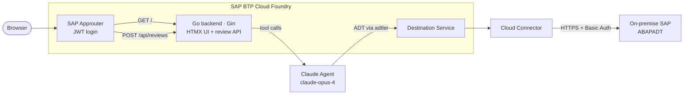

# AI ABAP Code Review Service

An AI-powered code review service for SAP ABAP, running on **SAP BTP Cloud Foundry**. Users submit a transport request ID via a web UI; a Claude agent autonomously fetches ABAP source objects from the on-premise SAP system via ADT, and returns a structured, printable markdown review.

## Architecture

## Quick start

1. Copy and fill `config.yml` — at minimum `examples.destination_name` and `examples.sap_client`
2. Set `ANTHROPIC_API_KEY` in your CF environment: `cf set-env <app-name> ANTHROPIC_API_KEY sk-ant-...`
3. Customize the review prompt: edit `internal/agent/prompts/review_prompt.md`
4. Run `go run ./cmd/apply-config` to rewrite the tree for your fork
5. `cf push` (cross-compile first: `make build-linux` or `.\scripts\build.ps1`)
6. Open `https://<your-approuter-host>/` and enter a transport request number

## Local development

**The server cannot run locally without BTP.** `cmd/server/main.go` calls `btp.LoadEnv()` on startup, which reads `VCAP_SERVICES` and `VCAP_APPLICATION` — CF-injected environment variables that are absent on a developer laptop. If they are missing the server refuses to start. This is intentional: there is no meaningful stub mode for the three-leg BTP dance (XSUAA → Destination → Cloud Connector).

Unit tests (`go test ./...`) run without any BTP or SAP credentials — they use fakes throughout.

For integration tests against a real SAP system see issue #5 — the `internal/agent/` tests can connect directly to SAP without the Cloud Connector, so only `SAP_INTEGRATION_*` env vars are needed, not a full BTP stack.

## How it works

1. **Submit** — the user enters a transport request ID (e.g. `DEVK900123`) at `GET /`.
2. **Create job** — `POST /api/reviews` validates the TR ID, creates an async review job, and redirects to `GET /reviews/:id`.
3. **Agent runs** — a Claude tool-use loop (`internal/agent/runner.go`) calls three ADT tools:
   - `list_tr_objects` — lists all ABAP objects in the transport request
   - `fetch_source` — fetches source for programs, function modules, includes
   - `fetch_class_includes` — fetches class definitions, implementations, and test includes
4. **Review ready** — the agent writes a structured markdown review; `GET /reviews/:id` polls every 3 s until the job is done, then renders printable HTML via goldmark.

ADT calls travel through the BTP Connectivity SOCKS5 proxy to the on-premise SAP system using the destination configured in `config.yml`.

## Customisation

| What                        | Where                                         |
| --------------------------- | --------------------------------------------- |
| Review prompt               | `internal/agent/prompts/review_prompt.md`     |
| AI model                    | `reviewModel` constant in `internal/agent/runner.go` |
| Token budget                | `reviewMaxTokens` constant in `internal/agent/runner.go` |
| Persistence (swap in-memory store) | implement `reviewstore.JobStore` interface in `internal/reviewstore/store.go` |

## Open issues / setup required

The following GitHub issues track one-time setup tasks required before the service is usable:

- [#1 Set ANTHROPIC_API_KEY in CF environment](../../issues/1)
- [#2 Configure config.yml with your SAP destination, client, and fork settings](../../issues/2)
- [#3 Customize the ABAP review prompt for your organisation](../../issues/3)
- [#4 BTP setup checklist (one-time cockpit tasks)](../../issues/4)

## License

MIT, see [LICENSE](LICENSE).

---

Built on [go-sap-btp-cf-template](https://github.com/Hochfrequenz/go-sap-btp-cf-template) — for BTP deployment, forking, XSUAA auth, Cloud Connector wiring, and everything else about the plumbing, see the template README.
